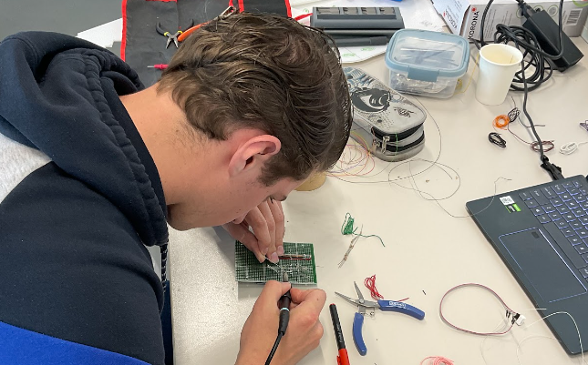

# Blog Corné de Beer

## Week 1: 05-09-2022

in deze week zijn we vooral met het opstellen van de user requirements bezig geweest. Ook hebben we de eerste gesprekken met de projectbegeleider gehad en hebben we contact gehad met de klant.

## Week 2: 12-09-2022

in deze week zijn de system requirements opgesteld en hebben we alvast gekeken naar bijpassende componenten hiervoor.

## Week 3: 19-09-2022

In deze week ben ik vooral bezig geweest met onderzoek naar de elektronica en sensoren. ook hebben we in deze week een totaal verdeling gemaakt voor het project wie wat wil gaan doen en wie wat wil leren. 

## Week 4: 26-09-2022

In deze week ben ik bezig geweest met het afmaken van de research. Ook heb ik alle benodigde componenten besteld zodat ik volgende week kan beginnen met het prototypen en testen van alle sensoren. 

## Week 5: 03-10-2022

In deze week ben ik begonnen om samen met Floris en Michael de sensoren te testen op een breadboard. Daarna toen iedere sensor bleek te werken ben ik begonnen om met een PCB te maken. 

## Week 6: 10-10-2022

In deze week ben ik verder gegaan met het maken van de PCB. toen de PCB af was heb ik deze volledig getest en alles werkte naar behoren. Tijdens het testen is helaas de Raspberry PI gesneuveld en hebben we een nieuwe moeten regelen. Hij is kapot gegaan doordat er een metalen voorwerp op de voeding was gevallen. hierna ben ik aan de slag gegaan om een behuizing om de elektronica te ontwerpen.

## Week 7: 17-10-2022

In deze week ben ik verder gegaan met het ontwerpen van de behuizing voor de elektronica en heb ik ook mijn PDP bijgewerkt omdat ik in de week hiervoor feedback op heb gehad in de feedback meeting.