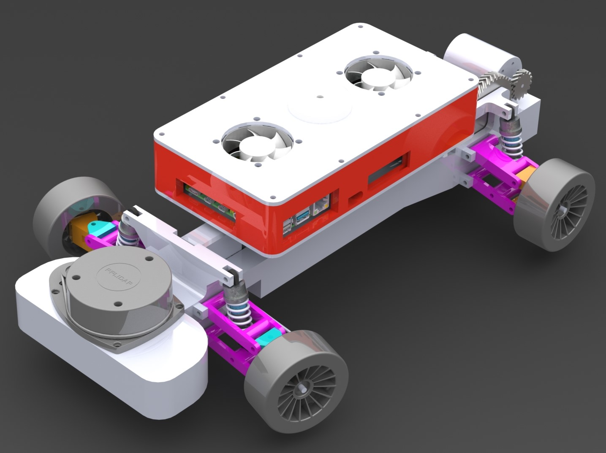

# Project Blog Rane van de Pas
## Week 1: 05-09-2022
Orienting in what we want to achieve and splitting our tasks, start writing our personal development plan.
## Week 2: 12-09-2022
Finishing writing my pdp and making the plan of approach with the team. Also starting research on differentials and steering. 
## Week 3: 19-09-2022
Researching gear ratio’s and different types of gears. (Spur, helical and V-gears)
## Week 4: 26-09-2022
Researching car suspension, designing front suspension of the car (double wishbone suspension).
## Week 5: 03-10-2022
Adjusting suspension to fit our specifications (20cm width) and researching steering on our car.
## Week 6: 10-10-2022
Putting the parts we have so far in SolidWorks, designing rear suspension and thinking about how to power the rear wheels
## Week 7: 17-10-2022
Visualizing the steering, dampers and drivetrain in CAD. (Documenting at home since public transport is striking again).
## Week 8: 31-10-2022
Finishing the rear suspension mounts, mounts for differential and the last finishing touches of the frame for the first prototype print. 

