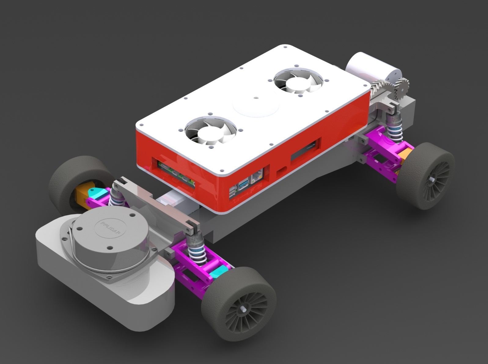

# Project Blog Rane van de Pas
## Week 1: 05-09-2022
Orienting in what we want to achieve and splitting our tasks, start writing our personal development plan.
## Week 2: 12-09-2022
Finishing writing my pdp and making the plan of approach with the team. Also starting research on differentials and steering. 
## Week 3: 19-09-2022
Researching gear ratio’s and different types of gears. (Spur, helical and V-gears)
## Week 4: 26-09-2022
Researching car suspension, designing front suspension of the car (double wishbone suspension).
## Week 5: 03-10-2022
Adjusting suspension to fit our specifications (20cm width) and researching steering on our car.
## Week 6: 10-10-2022
Putting the parts we have so far in SolidWorks, designing rear suspension and thinking about how to power the rear wheels
## Week 7: 17-10-2022
Visualizing the steering, dampers and drivetrain in CAD. (Documenting at home since public transport is striking again).
## Week 8: 31-10-2022
Finishing the rear suspension mounts, mounts for differential and the last finishing touches of the frame for the first prototype print. 
 
## Week 9: 07-11-2022 - Midterm
Assembling the prototype of the chassis, writing down problems we find so we can fix those. Midterm preparations.
## Week 10: 14-11-2022
This week Tom and I focussed on improving the turning circle of our car, we couldn’t make it round a 180 degree turn on the nxp track. First we made an adapter plate for our servo saver to create a larger center distance from the servo, this would greatly increase the turning radius.
Second thing we improved was the chassis, we shortened the wheelbase by around 2.5 centimeters and the total length of the car was reduced by around 4.5 centimeters.
## Week 11: 21-11-2022
This week we printed a new chassis, we did this using 2 materials so we could leave the chassis in water for a day and the supports would dissolve. This wasnt a great succes, the frame was sticky and smaller holes weren't empty of the material. We cleaned it asmuch as needed so we could use the frame. The has to be a working frame so we made some axles for our wheels, mounted the differential and gears. 
## Week 12: 28-11-2022
This week was a little les productive for me, still made some changes to the chassis. Also did some testing with Floris to check clearances and if everything runs smoothly. Then I sent the adjusted chassis to the printing lab so we had something to test on. We needen a new brushless motor that was compatible with our battery and ESC, we calculated new speeds etc. I also did some more documentation. 
## Week 13: 05-12-2022
This week we made obstacles for the track, made some minor modifications to the car that had to be done. We also started thinking about how we wanted our work instruction to be. Also worked on my personal development plan, updated with what I've done the past weeks.
## Week 14: 12-12-2022
This week we made a partslist that includes self made parts, nuts, bolts etc. that are needed to assemble the complete chassis. When this was finished I started thinking about what kind of instructions for assembling the chassis we want. We came up with a powerpoint with animations, in the slide tools and parts will be displayed, aswell as the subassembly and animation of how it goes together. We also looked at how we want to pull 60% of our total weight. We found a trailer that we can buy for cheap and easily attach to the car. 
## Week 15: 19-12-2022
This week I cleaned up the cad assembly so it would go together the same way in cad as you would do reallife. With this update I could animate the sub-asemblies for making the work instruction. I also started with the basic lay-out of the work instruction and made the first slide.
## Week 16: 09-01-2023
In this week I went on with the work instruction, the basic layout now is starting to come together and we have done all the suspension and differential parts. Meaning that we only need to do the main chassis work. 
## Week 17: 16-01-2023
This week I reassembled the chassis since it was destroyed at the end of last week. After I've done that I worked on the final project report. 
## Feedback Sessions
### First Feedback Session: 22-09-2022
Write down a date with revision number, the rest was good and no problems were found.
### Second Feedback Session: 13-10-2022
During the session I asked if there was any feedback, the answer was everything looks good as is, no problems were found. 
### Third Feedback Session: 08-12-2022
This session was a little different form the previous, we had to give feedback to eachother instead of getting it from our mentor. After my explanation I didn't recieve feedback from my fellow students. This means I am going to keep doing what I am doing since not getting feedback means I'm doing good work. 
### Third Feedback Session: 19-01-2023
Not that much feedback for this week either, just make sure you can explain what you did and how you did it. 
