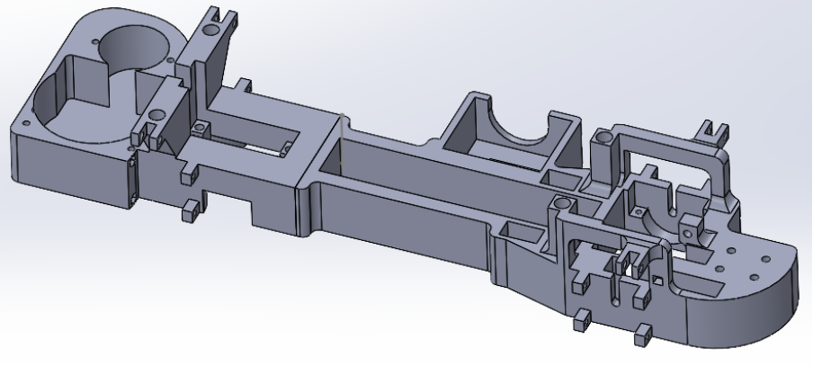

# Chassis & Suspension

## 1 Size of the car

To determine the size of the self steering car, the team had to look at the requirements for the car. The car has to accompany every component necessary for the car to function as required. This means that there needs to be enough space on the car to mount these components. Besides the electronic parts there also needs to be enough room for the wheels and suspension components. Due to there not being a limit to the size from Chris Lee the team has decided to replicate the size of a Ferrari F50 on a 1 to 10 scale. these dimensions being 200mm wide and 450mm long. The size of everyday cars are almost always more than two times longer than they are wider. With this size the suspension team can start designing their movement based on the wheelbase of the car since the angle of the wishbone is directly correlated to the steering capability of the car.

## 2 Components and basic chassis

In the 3d view of the first basic render of the vehicle, most of the main components are displayed on the chassis. In the first two research weeks of the project the team has decided that the chassis will only be a 3 mm thick aluminium plate. The team chose for this solution because there would otherwise not be a base to work with at the start of the car testing phase. With this solution the mounts for every component can be engineered to fit the real chassis in a further design phase. This reduces wasted time and makes for a more efficient design process.

## 3 Suspension

### 3.1 Dependent suspension

A solid axle is made with a very simple construction. Both wheels are connected, so when one wheel moves, the other one als moves. It is often used in heavy duty vehicles in combination with leaf springs. It is a very simple and cheap construction, which is very difficult to break. Sometimes it is still used in cars as a rear axle, but almost never as the front axle anymore. These types of suspension are not meant for high speed corners and have a bigger chance to roll over the car.

Pros:

- Easy construction
- Low mass when not powered
- No changes to toe, camber and track width when springs are compressed
- High centre of moment of inertia
- Easy to realise
- Relatively cheap

Cons:

- Relatively high unsprung mass, especially when powered
- The mutual influence of wheel movement
- Takes up a lot of space
- Toe and camber cannot be adjusted by the lateral forces

### 3.2 Independent suspension

Pros:

- Lower unsprung weight
- Course deviation with longitudinal forces are easy to correct
- No influence from the other wheels
- When springs are compressed, the wheels can be made to stay relatively straight
- Camber and track width can be influenced depending on springs and load
- Possible to make active suspension

Cons:

- Higher total mass
- Complicated construction
- When springs are compressed, track width will be adjusted
- Relatively expensive

### 3.3 Our choices

#### 3.3.1 Front suspension

For the front suspension, we chose to use independent suspension, specifically a double wishbone structure. We chose to use this, because it is not overly complicated and it is relatively easy to produce at this scale. Steering with this type of suspension is easy to realise and flexible in its mounting position. Building the steering is easy as well, while it’s overly complicated with many other types of independent suspension since you need to use ball joints in those constructions.

#### 3.3.2 Rear suspension

For the rear suspension, we first wanted to use a solid rear axle, due to the simple construction. In that case we would not have to use driveshafts with joints, which would make the construction more difficult. The client, however, told us that he wanted the option to make an active suspension. This meant that we had to make the rear suspension independent as well. Due to this change, we had some extra challenges. The biggest of which was that we need flexible driveshafts. The independent rear suspension also needed more space, which we did not have a lot of. We took the front suspension as a starting point for the rear suspension. We made some adjustments to make it all fit to the rear end and make space for the driveshaft. The wheelhubs also needed to be changed, becaus we did not need steering on the rear axle.

### Visualising

For the first design we made a double wishbone suspension with wheel hubs mounted to the outside of the wishbones, the principle worked. There was one problem where because of tolerances the two wishbones were moving towards each other which locked up the movements needed for dampening the shocks that suspension is designed for.

Knowing what the problem was, we changed the wheel hubs so they sit in between the two wishbones so they couldn't move towards each other and lock up the dampening movement.

As you can see in the picture below the vertical movement of the suspension is way greater because the wishbones stay mostly parallel to each other.

In this design we figured the car would be too big, Since the minimum width would be 26 centimetres, as shown in the picture below. We agreed on a car size of ca. 45x20cm (length x width) So we had to make the design smaller.

After making the whole suspension design smaller we have about 17.9cm in width left, note that this is without tires attached. With tires the width is to be seen because we can’t simulate how far our springs will compress since that will change track width.

As you can see in the previous pictures, we also changed the wheel hubs. We did this since the wheels we bought had a very narrow contact point, we thought friction would be a big problem. Fortunately the wheels had a hexagon on the inside. Inside of a hexagon shape is a radius, we made a circle of that exact same radius on the wheel hubs so we had more contact area so the friction would be separated over the wheel more. The circle would also improve stability when the wheel was turning so this is always a plus.

After assembling the smaller version of the front suspension and mounting the wheels we measured the exact width of the assembly. It is about 20-21cm which suits the requirements we have for our car.

After making the suspension smaller we adjusted the chassis so we could fit the suspension directly to it, this was to save time in assembling the whole car. Since we use a chassis that suits the style of suspension this was pretty easy.

For the rear independent suspension we had to make minor adjustments since the rear wheels need to be driven, instead of the spring going through the double-wishbone construction, we moved them right behind the wishbone.

## 4 Chassis

### 4.1 Different types of chassis

- Ladder Frame Chassis

One of the oldest chassis, the ladder chassis gets its name from the shape of has which simply put, is like a ladder. It has two long and heavy beams which are supported by two short beams. The main selling point of the ladder chassis was how easy it was to manufacture. During the beginning of the era of the automobile, technology was not really advanced and the simplicity of the ladder chassis made it easier to mass-produce. The chassis also makes the car assembly easier. The ladder chassis is quite heavy and thus still finds use in vehicles that need to tow heavy stuff around.

- Advantages
  - Easier to assemble as parts can be easily put in.
  - Construction method makes it quite tough.
  - Easier to fix as parts are not permanently attached.
- Disadvantages
  - The ladder chassis has a weak torsional rigidity making it bad for cornering.
  - Heavyweight makes it not ideal for sports cars or hatchbacks.
- Backbone Chassis

It also gets its name from how it’s constructed. A rectangular cross-section cylindrical tube through the middle of the chassis that connects the top and the bottom suspension. The backbone. It’s present in cars like Skoda Rapid and DMC DeLorean. The cylindrical tube actually covers the driveshaft thus making it safer from getting damaged which can also be a disadvantage.

- Advantages
  - Due to its construction, the half axle has better contact with the ground when off-roading.
  - The driveshaft is covered by the chassis, making it more likely to survive off-roading.
  - The structure has good torsional rigidity allowing it to withstand more twist than ladder chassis.
- Disadvantages
  - The driveshaft repair is complicated if it fails as the main chassis covers the entire shaft which makes it necessary to open it.
  - The manufacture of backbone chassis is quite expensive which increases the cost of cars it is in.
- Monocoque Chassis

A unibody structure, it too gets its name from its structural look. Monocoque being French for ‘single shell’ or a ‘single hull’. The monocoque was first used by ships and then by aeroplanes. It took quite some time to figure out that they can be used in cars as well. A monocoque is a shell around the car made by using both chassis as the frame in a single construction. This is the most commonly used chassis right now due to the number of advantages it has over the other two chassis.

- Advantages
  - It’s safer than both the other chassis due to its cage-like construction.
  - The chassis is easy to repair as well.
  - It has superior torsional rigidity.
- Disadvantages
  - The chassis is obviously heavy as it’s both the frame and chassis as one single entity.
  - Producing it in small quantities is not financially feasible and thus it cannot be used for cars that are not mass-produced.
- Tubular chassis

Tubular chassis were mainly used in race cars due to the unrivalled safety they provide. These were an upgrade from the ladder chassis as they were three dimensional and were stronger than ladder chassis. They employed the use of a strong structure below the doors to get more overall strength. Tubular chassis are rarely used on passenger cars.

- Advantages
  - Better rigidity compared to other chassis in the same weight.
  - Offers the best weight/rigidity ratio allowing the car to be lightweight while being strong.
  - Best choice for race cars due to lightweight and better rigidity than other chassis.
- Disadvantages
  - Tubular chassis are complex structures and cannot be made using autonomous methods.
  - Tubular chassis are time-consuming to build and cannot be mass-produced.
  - Not feasible to be used on passenger cars.
  - The structure raises the door which makes it difficult to access the cabin.
- Plate chassis

In the Rc-world people often use plate’s that they drill holes in and mount everything on, a plate basically has the same advantages and disadvantages as a ladder frame chassis. Making a plate would be extra weight when compared to a ladder frame chassis.

### 4.2 Chassis choice

Making a choice for our project we used the kesselring method, the explanation of this method can be found in the sources and the end of this document.
As is visible in the Kesselring method above, the ladder-frame chassis and backbone chassis came out really close. We chose the backbone chassis above the ladder-frame because it’s way more rigid and we found out that it is easy to 3d-print. If we went with a ladder-frame chassis we would have to make it out of aluminium to get rigidity. And producing something out of aluminium would greatly increase costs. Since 1kg of PLA filament for printing is around 20-30 euros our whole chassis weighs about 350 grams. Making it out of aluminium would cost around 20 euros. 3D-printing is also way easier since you just let it run for a day and your chassis is finished, making it out of aluminium would cost us a lot more time. We could try to 3d-print a ladder-frame chassis but since the construction of this type of chassis we would probably shred through those frames when the frame is twisted a little.

### 4.3 Visualising

At first we started modelling a basic backbone chassis with the size constraints we put on it, with this rough estimate we started to think about where to put some parts. We came up with putting the battery in the backbone, we figured this would be fine if we don't put strain on the battery. Of course when designing the basic chassis we had other parts in mind, like the motor so we knew we had width to put the motor on.

When we were happy with our basic design we made mounting points for the suspension and modified the suspension a little so the track width would stay the same at the front and rear. Next up we made space for the differential, gears and motor in the back. We had some trouble fitting it all so we had to make the diff a bit smaller and adjust the gearing a little so there would be enough clearance for the motor-cooler. When our differential was finished and we knew the maximum dimensions were final we made the fitment final in the chassis.

When this was finished we stumbled upon some trouble with the turning radius of the car, this meant we had to adjust the steering and chassis completely. When we knew we had to “remake” the chassis we also figured we could cut out some pieces of plastic and clean the general design. This means we tried to remove printing supports where it was possible, we changed the mounting points for the electrical box, making the electrical box a magnetic snap on and forging the mounting points into the suspension construction to save as much print time as possible. We also merged part of the front suspension with the front bumper.

As you can see, the redesign is roughly the same. It is however a bit shorter and slimmer in some places. One thing we forgot on the first version was the mount for the motor control unit, this was added here as well. We also simplified the mounting points for front suspension and mounts for the electrical box. Merging them in parts we couldn't remove anyways so the printer doesn't have to jump to different places when doing the top layers. This saves a lot of time, the difference in print time between version one and two was roughly nine hours. We also made some small changes to places where hardware needs to be mounted because it didn’t quite fit on the first version, this was because print tolerances aren’t as predictable as a cnc-machine.

We are still looking for a feature that can print different infill percentages on different zones of the chassis. Since we don't really need a high infill percentage at every part of the chassis, we want to try this feature so we can save even more print time

## Sources

<table>
  <tr>
   <td><strong>Title</strong>
   </td>
   <td><strong>Date Accessed</strong>
   </td>
  </tr>
  <tr>
   <td><a href="https://www.extrica.com/article/15775">Some basic tips in vehicle chassis and frame design | Extrica - Publisher of International Research Journals</a>
   </td>
   <td>
   15 Sept 2022
   </td>
  </tr>
  <tr>
   <td><a href="https://gomechanic.in/blog/types-of-car-chassis/">Types Of Car Chassis Explained | From Ladder To Monocoque!</a>
   </td>
   <td>
   19 Sept 2022
   </td>
  </tr>
  <tr>
   <td><a href="https://www.spinny.com/blog/index.php/types-of-suspensions/">Types of Suspensions - List of Different Types of Suspensions (spinny.com)</a>
   </td>
   <td>
    4 Oct 2022
   </td>
  </tr>
  <tr>
   <td>Voertuigconstructies - Wielophangingen, Fontys Hogeschool Automotive
   </td>
   <td>
   4 Oct 2022
   </td>
  </tr>
  <tr>
   <td><a href="https://studentlesson.com/types-of-suspension-system/">Different types of suspension system and their functions - studentlesson</a>
   </td>
   <td>
   4 Oct 2022
   </td>
  </tr>
  <tr>
   <td><a href="https://httoolbox.wordpress.com/kesselring/#:~:text=Met%20behulp%20van%20de%20kesselring,krijgen%20nog%20een%20weegfactor%20mee">Kesselring </a>
   </td>
   <td>
   4 Oct 2022
   </td>
  </tr>
</table>
