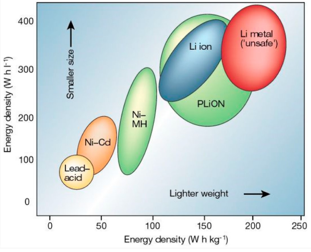

# Power Delivery

## 1 - System requirements

<table>
  <tr>
   <td>1.
   </td>
   <td>The battery needs to deliver enough power to:
<ul>

<li>Drive 400m on 50% speed and 160% weight of the car
</li>

<li>Drive the obstacle parkour
</li>
</ul>
   </td>
   <td>must
   </td>
  </tr>
  <tr>
   <td>2.
   </td>
   <td>Small enough to fit in the car
   </td>
   <td>must
   </td>
  </tr>
  <tr>
   <td>3.
   </td>
   <td>Light as possible
   </td>
   <td>should
   </td>
  </tr>
  <tr>
   <td>4.
   </td>
   <td>Minimum voltage of 7.2v
   </td>
   <td>must
   </td>
  </tr>
  <tr>
   <td>5.
   </td>
   <td>Battery voltage readable for control system
   </td>
   <td>must
   </td>
  </tr>
</table>

## 2 - Battery

The following is a comparison of the technical advantages and disadvantages.

### Lipo

#### Advantage

- Rechargeable
- Light weight towards the weight and the dimensions

#### Disadvantage

- A compact charger system needed

### Li-ion

#### Advantage

- Rechargeable
- Light weight towards the weight and the dimensions

#### Disadvantage

- A compact charger system needed

### NiMH

#### Advantage

- Rechargeable

#### Disadvantage

- A bit heavier than Lipo / Li-ion, towards the weight and the dimensions

### Lead battery

#### Advantage

- Rechargeable

#### Disadvantage

- Very heavier
- Low power towards the weight and the dimensions

### Alkaline battery

#### Advantage

- Nothing

#### Disadvantage

- Not rechargeable
- 1.5v per cell
- Low power towards the weight and the dimensions

All the advantages and disadvantages are based on information from the following source: [The difference between lithium ion and lithium polymer batteries](<https://www.batterypowertips.com/difference-between-lithium-ion-lithium-polymer-batteries-faq/#:~:text=LiPos%20offers%20several%20performance%20enhancements,solid%20polymer%20electrolytes%20(SPEs)>)

### Decision

Based on the advantage and disadvantage points we decided to go for a Li-ion or a Lipo battery. In a normal RC car they use Lipo batteries so they are less expensive and in the right size of an RC car. They also have the same connectors as most of the cars and that kind of connectors are not expensive and good to buy. For the capacity of the battery we look to the advice of the ESC. The RaspberryPI and the sensor use almost the same as a remote control of a RC car. So that is why we chose for this battery:

## 2 - Monitoring voltage

The live capacity of the battery must also be available for the control system. The possibilities to monitor battery voltage are the following:

### Mcp3002

The mcp3002 is an analog to digital converter and needs 2 GPIO pins and is not readable with any bus system. The input of the ADC must be scaled down to max 3.3v through a voltage divider.

[Controlled shutdown duration test of Pi model A with 2 cell lipo – RasPi.TV](https://raspi.tv/2013/controlled-shutdown-duration-test-of-pi-model-a-with-2-cell-lipo)

### INA226

This board can also measure the power that walks from the battery. This means the power also goes to the sensor and it is limited by 20 amps.

[INA226 I2C DC Stroom- en spanningsmeter 20A Module](https://www.tinytronics.nl/shop/nl/sensoren/stroom-spanning/ina226-i2c-dc-stroom-en-spanningsmeter-20a-module)

### ADS1115

This breakout board can measure the voltage over the battery and communicate over I2C. This comes in handy because we already have the I2C protocol in the car. So we can just add it in the bus protocol and read it out when we want it.

### Decision

We chose the ADS1115 because of the connectivity with the I2C protocol. This makes it way easier to insert it in the hardware of the car. The ADS1115 measures the voltage with the basis of the ground. This makes it difficult to measure the voltage of every cell individually. We made a small electric circuit on the main PCB. We make the circuit with an opamp. This makes that only the difference between the cells is going to the analog to digital converter.

## 3 - Charging

The charging of the battery is also an important part of the problem. One of our team members takes part in airsoft as a hobby and has a specialised charger for his LiPo batteries to charge them properly. \
The charger he has is the [Professional Balance Charger/Discharger i6AC+ 80W [IPower]](https://www.taiwangun.com/battery-chargers/professional-balance-charger-discharger-i6ac-80w-ipower) We can use it for this project but after it he wants it back (of course). We select another loader that can be used: [VOLTCRAFT V-Charge 60 DC](https://www.conrad.nl/nl/p/voltcraft-v-charge-60-dc-multifunctionele-modelbouwlader-12-v-6-a-li-poly-li-ion-lifepo-lihv-nicd-nimh-lood-1597950.html?utm_source=google&utm_medium=surfaces&utm_campaign=shopping-feed&utm_content=free-google-shopping-clicks&utm_term=1597950&adcampaign=google&tid=17213980048_pla-1597950&gclid=CjwKCAjwyaWZBhBGEiwACslQo0jiEy0GHrJRFHoUZsDhnM8Sb8Jdt5i7AE91BDZiS0Z0ZmAFsjEzsRoCufYQAvD_BwE)

## 4 - Links

<table>
  <tr>
   <td><strong>Title</strong>
   </td>
   <td><strong>Date Accessed</strong>
   </td>
  </tr>
  <tr>
   <td><a href="https://www.rccaraction.com/everything-need-know-rc-batteries/">Everything You Need to Know About RC Batteries</a>
   </td>
   <td>
   28 Sept 2022
   </td>
  </tr>
  <tr>
   <td><a href="https://www.taiwangun.com/battery-chargers/professional-balance-charger-discharger-i6ac-80w-ipower">Professional Balance Charger/Discharger i6AC+ 80W [IPower]</a> 
   </td>
   <td>
   28 Sept 2022
   </td>
  </tr>
</table>
